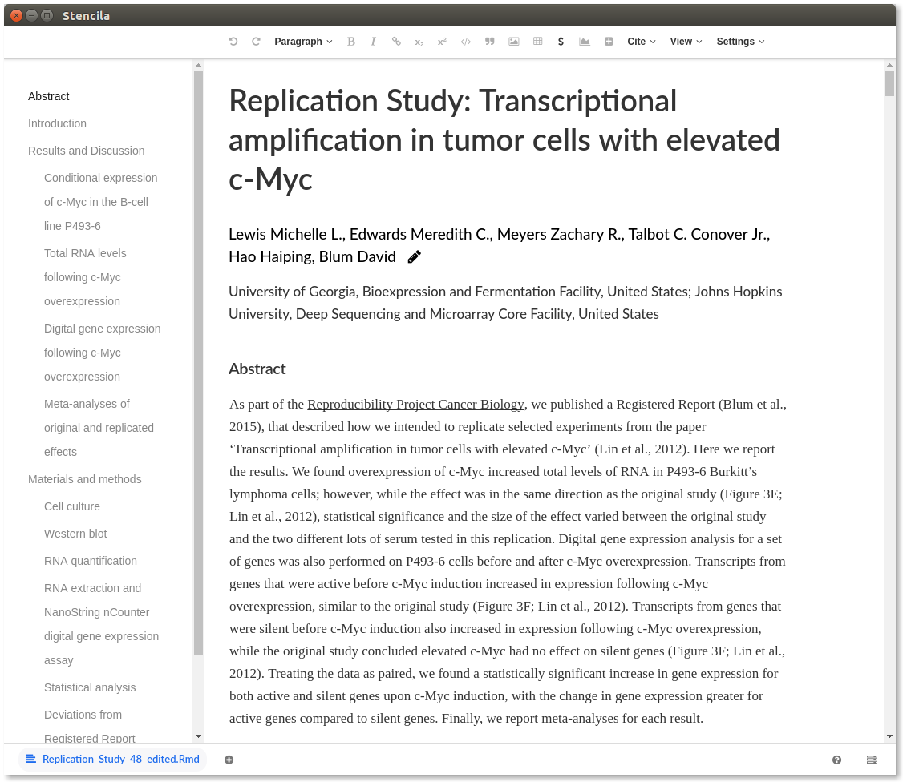

## Replicating a replication study

This example replicates the paper:

> Lewis, L. Michelle, et al. "Replication Study: Transcriptional amplification in tumor cells with elevated c-Myc." eLife 2018;7:e30274 DOI: 10.7554/eLife.30274

The full [article is available on the eLife website](https://elifesciences.org/articles/30274) and there is an Open Science Framework [folder containing code and data](https://osf.io/mokeb/).

This example addresses the use case of a researcher who already uses RMarkdown and who wants to keep their work in that format as long as possible towards the final publication (i.e avoiding conversion to intermediate formats like `.docx` or `.pdf`)

The publication is available in [RMarkdown format](https://osf.io/vdrsh/download) and saved here as [`Replication_Study_48.Rmd`](https://github.com/stencila/examples/blob/master/elife-30274/Replication_Study_48.Rmd). Some pre-processing of the RMarkdown was done:

1. Deleted the YAML header which included `knitr` and `pandoc` processing instructions e.g. `fontsize: 12pt`.

2. Extracted the first two, preliminary code chunks which install packages and download data to [`article/packages.R`](https://github.com/stencila/examples/blob/master/elife-30274/article/packages.R) and [`article/data.R`](https://github.com/stencila/examples/blob/master/elife-30274/article/data.R).

3. Converted meta data from formatted text to structured YAML front matter.

You can compare the [original downloaded file](https://github.com/stencila/examples/blob/master/elife-30274/Replication_Study_48.Rmd)
with the [file we edited](https://github.com/stencila/examples/blob/master/elife-30274/article/article.Rmd).

Currently Stencila Desktop allows you to directly open only Dar (Reproducible Document Archive) format. So we used the Stencila [CLI](https://github.com/stencila/cli) to convert the file into `Replication_Study_48.dar`. 

There are still a few more steps to complete:

4. Complete translating meta data to YAML front matter.
5. Translate the references into reference elements.
6. Put reproducible tables and figures inline (currently at end of document).
7. Implement [inline code cell outputs in Stencila](https://github.com/stencila/stencila/issues/618).

