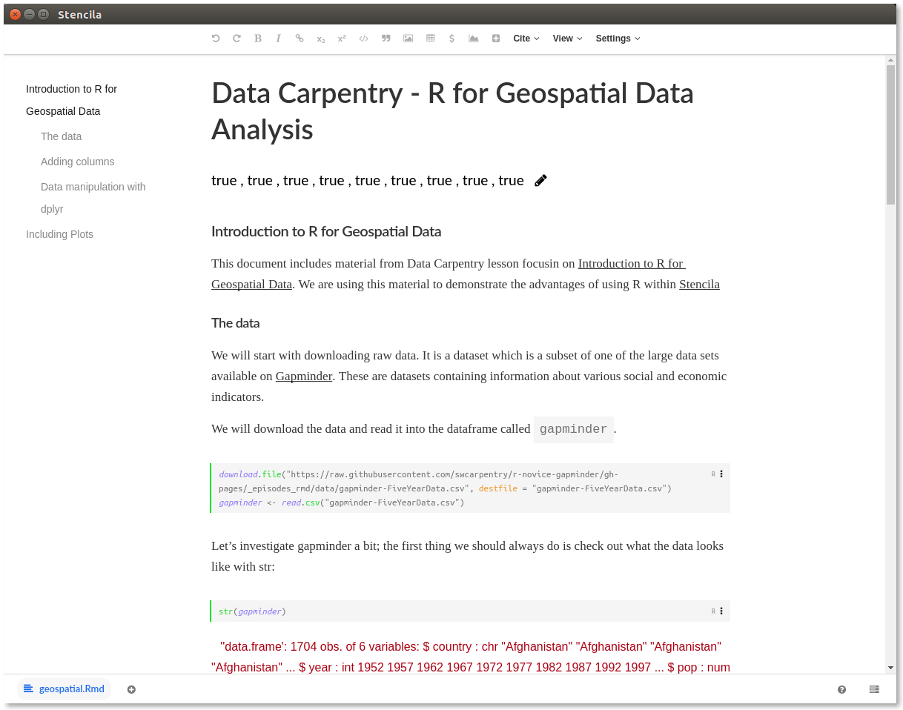

## Data Carpentry material in Stencila

This example shows how to use R `dplr` package to analyse data within Stencila. We used examples from [Data Carpentry](http://www.datacarpentry.org) lesson 
for geospatial data analysis. We created an RMarkdown file with the code examples from the lesson and copied over some of the
other lesson context.

## Getting started

If you are not familiar with RMarkdown but would still like to play with the above exmples, try the following:
1) download and install Stencila Dekstop
2) download the [examples directory in zip format](https://github.com/stencila/examples/archive/master.zip); and unzip it
3) launch Stencila Desktop and open the folder `geospatial.dar` which is contained within `examples/geospatial` folder
4) you should be able to see the RMarkdown document in Stencila; most likely the code cells will not be interactive.
5) in order to get the code in the cells become executable, you need to install and run the R execution context for Stencila.

You can now try and carry on with the Data Carpentry material [from where we left off](http://www.datacarpentry.org/r-intro-geospatial/10-dplyr/#count-and-n)

