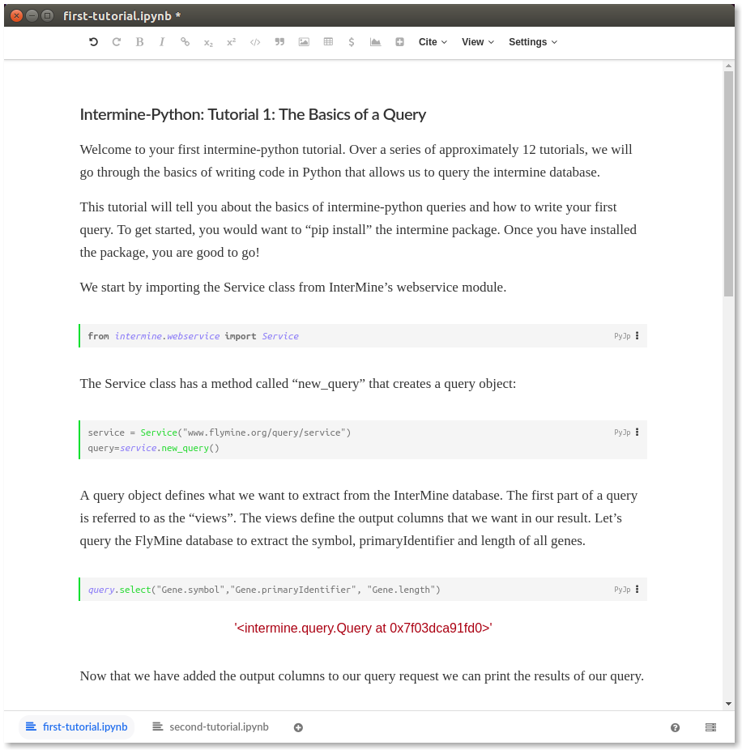
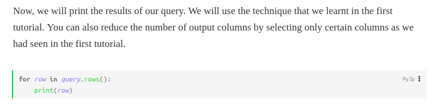

## InterMine webservice tutorials

### Introduction

[InterMine](http://intermine.org/) is open-source software which integrates biological data sources, making it easy to query and analyse data. There are many different InterMines worldwide, covering a broad range of model organisms and life science research areas.

The [intermine/intermine-ws-python-docs](https://github.com/intermine/intermine-ws-python-docs) repo has several Jupyter notebook tutorials to help researchers get familiarised with the `intermine-python` package.

This example converts the tutorial notebooks into a single [Dar](https://github.com/substance/dar) document archive which can be opened and executed in Stencila Desktop.



### Approach

This is a **preliminary** version of this example!

To convert the `.ipynb` files into the XML files in `tutorials.dar` we used the [`stencila/cli`](https://github.com/stencila/cli) tool (you don't need to do that, the XML files are committed into this repo)

```bash
stencila convert tutorials tutorials.dar
```

To open and run the `tutorials.dar` folder using Stencila Desktop you will need an `ipython` kernel installed on your system.

### Next steps

- Add all the Intermine `*-tutorial.ipynb` files into `tutorials`

- Decide how to approach console outputs i.e. `print` statements. Currently, `stdout` display data is not being captured from Jupyter kernels. e.g. there is no output from the cell in the screenshot below. This is intentional, Stencila takes a more "function-like" approach to code cells. For compatability with Jupyter notebooks using `print`, one option (the simplest, and probably the most consistent), is to return the `stdout` output as a plain string data value. The other option (which will require more work, for this example, and generally) would be to rewrite the tutorial code cells to return a value (e.g. a Pandas data frame), rather than using print



- Create a Docker image with `intermine` package installed so that you can open this example using Binder or Stencila Hub

- Write an `export` method for [`IPYNBConverter`](https://github.com/stencila/convert/blob/master/src/IPYNBConverter.js) so that when you edit a tutorial in Stencila Desktop you can save it back to `.ipynb`
