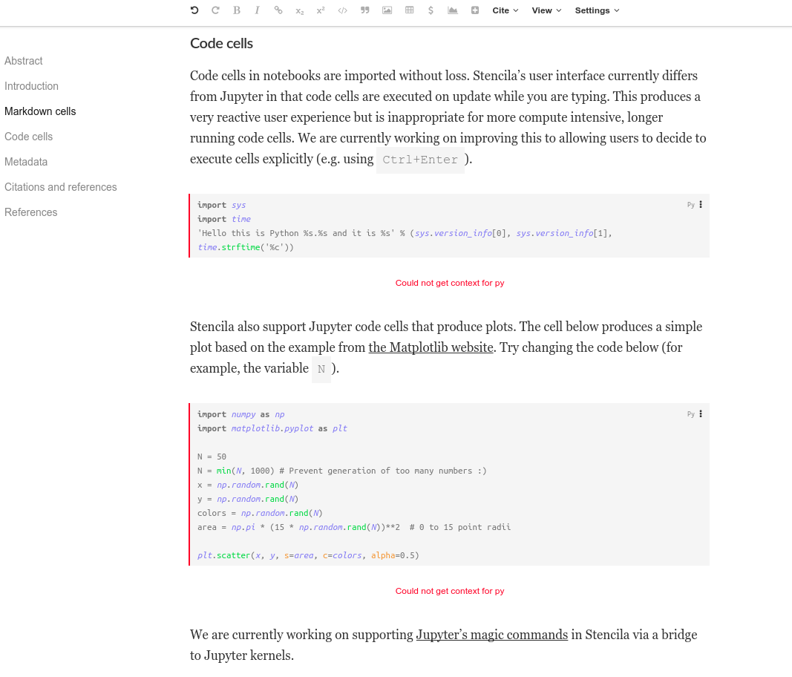

# Using Jupyter Notebook files in Stencila

This example shows how to get started using [Jupyter Notebook](http://jupyter.org/) in Stencila.

Stencila converters allow you to convert a Jupyter Notebook file (*ipnyb*) in Stencila. Stencila will retain the
interactive code cells and keep the Markdown cells editable.

You can also edit Notebook metadata such as authors:

Stencila allows you to add references to your Notebook using *bibtex* format

