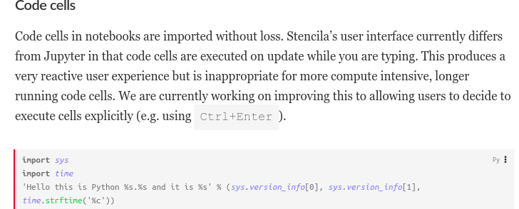
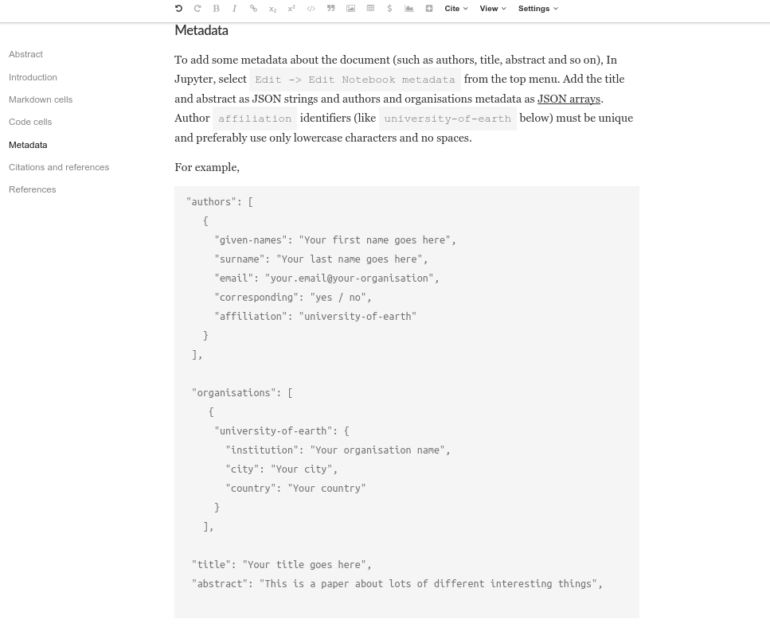
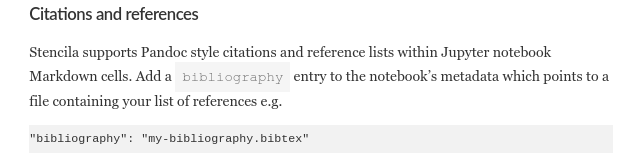

## Converting a Jupyter Notebook to DAR JATS XML

This example demonstrates the results of conversion a [Jupyter Notebook](http://jupyter.org/) to a DAR folder using the Stencila [Converter](https://github.com/stencila/convert) CLI tool.

The [`py-jupyter.source`](https://github.com/stencila/examples/tree/master/py-jupyter/py-jupyter.source) directory contains the original notebook. The [`py-jupyter.dar`](https://github.com/stencila/examples/tree/master/py-jupyter/py-jupyter.dar) directory contains the conversion result.

For editable version of this document go to http://builds.stenci.la/stencila/update-the-introduction-rds-example-2018-11-19-db47651/example.html?archive=py-jupyter. It has a lot more details. You can attach a local Python execution context if you have it installed to make the document executable.

The following are some screenshots from that document illustrating some of the features of the converter:

### Code cells

Jupyter code cells are converted to Stencila code cells:

### Meta data

Meta data embedded into the Jupyter Notebook e.g. author, are converted to the equivalent JATS meta data:

### Citations and references

The converter will also deal with references in your Notebook (see the editable version above for more details):

