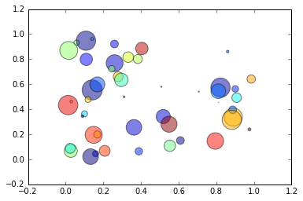

# Preface

This is part of a series of "self-documenting" example articles, each written in a particular format, describing how to author reproducible articles in that format. The canonical source for this article is [word.docx](https://github.com/stencila/examples/tree/master/word/word.docx) on Github. You can open this article on Stencila using [this link](https://hub.stenci.la/open/https://github.com/stencila/examples/tree/master/word/word.docx) (if you aren't already :)

Other articles in this series for other formats / sites:
- [RMarkdown](https://hub.stenci.la/open/https://github.com/stencila/examples/tree/master/rmarkdown/rmarkdown.Rmd)
- [Google Docs](https://hub.stenci.la/open/https://docs.google.com/document/d/1BW6MubIyDirCGW9Wq-tSqCma8pioxBI6VpeLyXn5mZA)
- [HackMD](https://hub.stenci.la/open/https://hackmd.io/RaFYCFoyTlODFxz5hPevLw)


# Introduction

Word files (`.docx`) are usually seen as the final output of a reproducible research document. This one-way flow can slow the review-iteration process: researchers manually create Word versions of their research scripts, have them reviewed, and then incorporate the changes back to their source files manually. Using Stencila's Encoda, lossless conversion between docx and source documents is possible (with the automatic use of rPNGs). Reviewers can make changes in Word and then researchers can easily convert back and forth to source documents automatically.

# Code Chunks

Any CodeChunks in the source document are stored in docx as rPNG files. Word will display the output but hide the source code. Once converted back to a source format, the code is retrieved from the rPNG as is editable again.

chunk:
:::
```python execution_count=1
import sys
import time
'Hello this is Python %s.%s and it is %s' % (sys.version_info[0], sys.version_info[1], time.strftime('%c'))
```

'Hello this is Python 3.6 and it is Thu Oct 10 11:17:54 2019'
:::

Stencila also support storing code chunks that have plot or image outputs.

chunk:
:::
```python execution_count=1
import numpy as np
import matplotlib.pyplot as plt

N = 50
N = min(N, 1000) # Prevent generation of too many numbers :)
x = np.random.rand(N)
y = np.random.rand(N)
colors = np.random.rand(N)
area = np.pi * (15 * np.random.rand(N))**2  # 0 to 15 point radii

plt.scatter(x, y, s=area, c=colors, alpha=0.5)
```


:::


# Code Expressions

`CodeExpressions` are rendered inline (this simple expression is evaluating 2+2): `2+2`{type=expr lang=python output=4}

Try converting this document back to another format with the Stencila CLI tool or [Stencila Open](https://hub.stenci.la/open), and you will reveal the source code that generated these outputs.

# Lists

Also supported are other features like lists

1. With
2. Numbered
3. Items

- Or
- With
- Bullets

# Headings

Headings of different sizes are supported too. The headings you have seen so far are all level one headings.

## Level 2 Heading

### Level 3 Heading

#### Level 4 Heading

# Other Formatting

Subscript and super script can be used, like a^2^ = b^2^ + c^2^, or H~2~O. Plus **bold** and _italics_.

